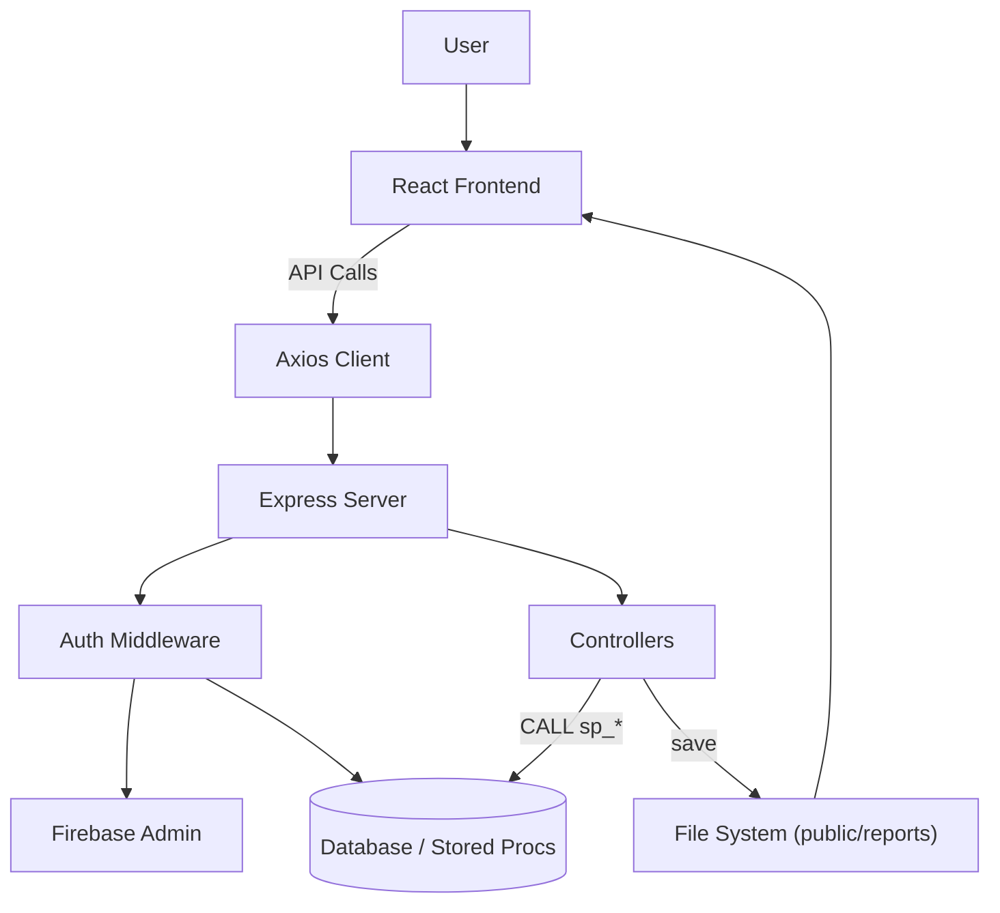
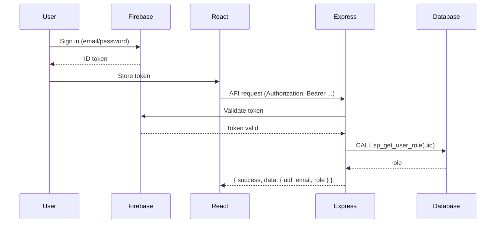

# HR Monitoring and Evaluation System

This repository contains a full-stack Human Resources Monitoring & Evaluation application used by the Department of Human Resources Management. The system centralizes employee records, performance evaluations, recruitment, training, calendar events, and reporting.

This README documents the architecture, code components, how the system works, quick user docs, and a data-flow diagram (Mermaid) you can render on GitHub or locally.

## Table of contents

- Project overview
- Architecture and components
- How it works (request/response flows)
- User documentation
- Data flows (Mermaid diagrams)
- Developer setup & troubleshooting
- API Quick Reference

---

## Project overview

React + TypeScript frontend (Vite) and Express + TypeScript backend. MySQL stores data and stored procedures perform core CRUD/reporting. Firebase provides authentication.

Key goals: role-based access (admin/hr/employee), calendar-driven event management, and report generation (JSON/CSV/XLSX/PDF).

## Architecture and components

- `client/` — React frontend (Vite)
- `server/` — Express backend
- `server/sequelize.sql` — DB schema and stored procedures

## How it works (key flows)

1. Client authenticates with Firebase and stores an ID token in `sessionStorage.user`.
2. Axios client (`client/src/api.ts`) attaches the token to API requests.
3. Server middleware validates the token (Firebase Admin) then queries DB (`sp_get_user_role`) for authoritative role.
4. Controllers call stored procedures for calendar, reports, employees, etc.

## User documentation (quick)

- Sign in at `/auth`. Newly registered accounts require admin approval (role assigned in DB).
- HR: use Calendar page to create/edit events and Reports page to generate reports.
- Admin: appoint HR users via AdminUsers page.

## Data flows (Mermaid diagrams)

Below are three simple Mermaid diagrams (simplified data flow, detailed flowchart, and login sequence). Each block is correctly fenced with ```mermaid and closed with ```.

Simplified data flow:

```mermaid
flowchart TD
  subgraph Client
    C["Browser / React App"]
    F["Firebase Auth"]
    A["API Client (axios)"]
    C -->|Sign-in| F
    C -->|API requests| A
  end

  subgraph Server
    S["Express Server"]
    Ctrl["Controllers"]
    Files["public/reports"]
    A --> S
    S -->|Validate token| F
    S -->|Get role (sp_get_user_role)| DB[(MySQL)]
    S --> Ctrl
    Ctrl --> DB
    Ctrl --> Files
  end

  Files -->|Saved report URL| C
```

Detailed flowchart:



Login / role sequence:



## Developer setup & troubleshooting

1. Install dependencies:

```bash
cd client && npm install
cd ../server && npm install
```

2. Start services:

```bash
# start backend
cd server
npm run dev

# start frontend
cd ../client
npm run dev
```

3. If `/api/*` calls return Vite HTML, either start the backend or add this proxy to `vite.config.ts`:

```ts
server: { proxy: { '/api': 'http://localhost:3800' } }
```

## API Quick Reference

- `GET /api/auth/me` — Return { success: true, data: { uid, email, role } }
- `GET /api/calendar/events` — Get events
- `POST /api/calendar/events` — Create event
- `PUT /api/calendar/events/:id` — Update event
- `DELETE /api/calendar/events/:id` — Delete event

---
